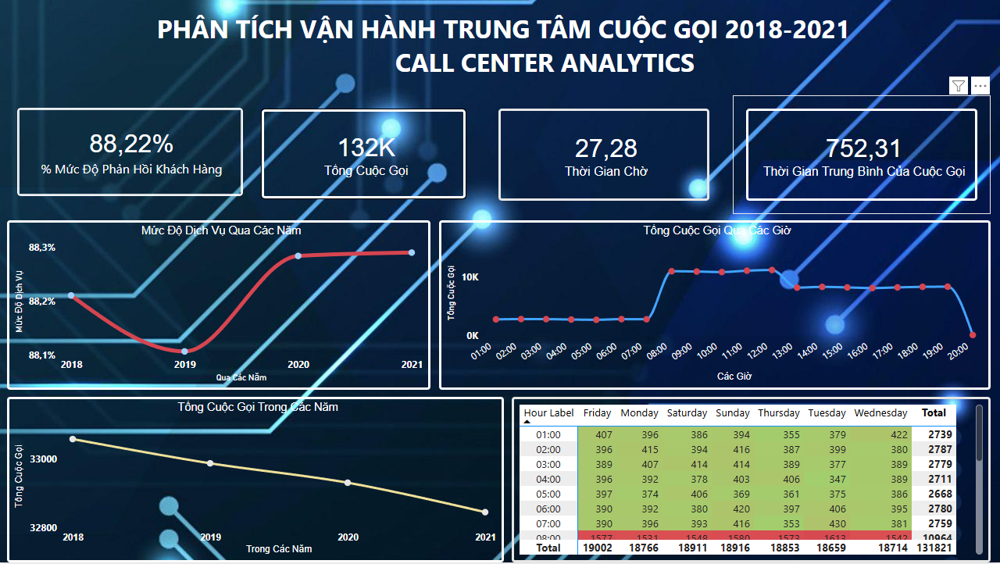

# 📞 Call Center Analytics Dashboard

## Project Overview

This project analyzes call center operations and customer service performance using Power BI.

The dashboard provides insights into:

- Total Call Volume
- Customer Satisfaction
- Average Waiting Time
- Average Call Duration
- Service Level Trends
- Peak Calling Hours

---

## Business Questions

### 1. Customer Service Performance

- How satisfied are customers over time?
- Is service quality improving or declining?

### 2. Call Volume Analysis

- What are the peak call hours?
- Which periods receive the highest number of calls?

### 3. Operational Efficiency

- How long do customers wait before being served?
- How does average call duration change over time?

### 4. Workforce Planning

- Which hours require additional staffing?
- What patterns can be observed by day and hour?

---

## Tools Used

- Power BI
- Power Query
- DAX
- Excel

---

## Key KPIs

| KPI | Description |
|------|------|
| Total Calls | Total incoming calls |
| Customer Satisfaction % | Service quality indicator |
| Average Waiting Time | Customer waiting duration |
| Average Call Duration | Average handling time |

---

## Dashboard Pages

### Overview Dashboard

---

## Key Insights

- Customer satisfaction remained above 88%.
- Call volume peaks between 08:00 and 12:00.
- Waiting time decreased over time.
- Certain hours consistently generate higher call traffic.

---

## Skills Demonstrated

- Data Cleaning
- Data Modeling
- DAX Measures
- KPI Development
- Dashboard Design
- Business Intelligence

---

## Author

GitHub: https://github.com/12312222/Call-Center-Analytics-PowerBI

